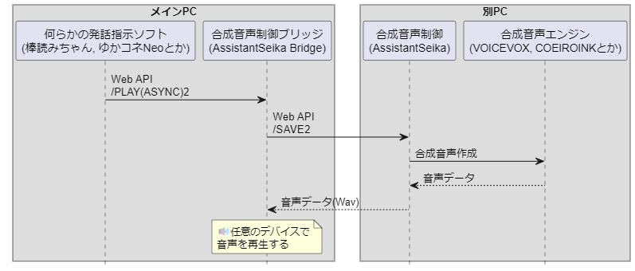

# AssistantSeika Bridge

別PCで動いているAssistantSeikaから音声データを受け取って音声を再生するアプリ

※ メインPCだけで運用している場合、このアプリを使うメリットはほぼありません。

シーケンス図



## 設定

### config.json

必須

| キー           | 内容                                         |
| -              | -                                            |
| server.port    | 待ち受けポート番号                           |
| assistantSeika | 別PCで動いているAssistantSeikaのHTTP機能情報 |

任意

| キー                  | 内容                             |
| -                     | -                                |
| voice.soundDeviceName | 音声を再生するサウンドデバイス名 |
| voice.maps            | 音声のマッピング情報             |

#### voice.soundDeviceName

未設定の場合、規定のサウンドデバイスで再生されます。

`ShowSoundDevice.exe`を実行する事でサウンドデバイスを列挙する事もできます。

#### voice.maps

特定の`cid`を、指定したサウンドデバイスで再生する事ができます。
`cid`は正規表現(完全一致)で指定する事ができます。

例. COEIROINKの音声を`VB-Audio Virtual Cable`で再生する

```
"maps": [
  {
    "cid": "9....",
    "soundDeviceName": "スピーカー (VB-Audio Virtual Cable), Windows DirectSound"
  }
]
```

配列になっているため複数の設定が可能です。
マッチングは上から順に評価される事を留意してください。

## 起動方法

`AssistantSeikaBridge.exe`を実行してください。

## 貢献する

このソフトに貢献したい場合は、Issue を開いてアイデアを議論するか、プルリクを送信してください。

ただし、このツールは私の配信のために作ったので、余計な機能は付けませんし、使わない機能は削除します。

## 作者

ナツキソ

- X(旧Twitter): [@natukin1978](https://x.com/natukin1978)
- Mastodon: [@natukin1978](https://mstdn.jp/@natukin1978)
- Threads: [@natukin1978](https://www.threads.net/@natukin1978)
- GitHub: [@natukin1978](https://github.com/natukin1978)
- Mail: natukin1978@hotmail.com

## ライセンス

AssistantSeika Bridge は [MIT License](https://opensource.org/licenses/MIT) の下でリリースされました。
